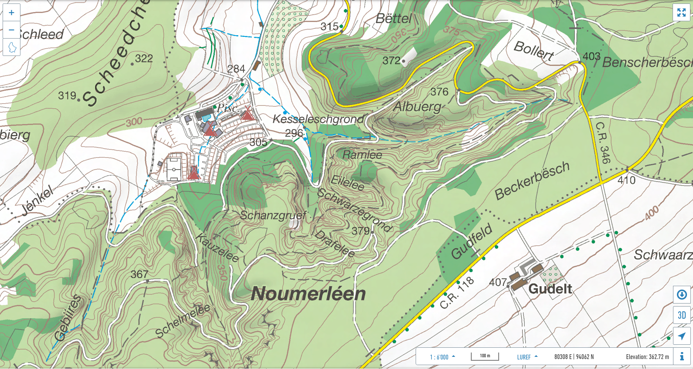
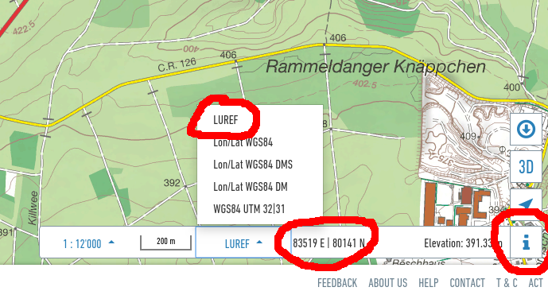

# How to produce an orienteering map from ACT LIDAR data with Karttapullatin?

## Requirements

- A PC with windows
- A bit of time !

## Download Karttapullatin

See on [Karttapullatin website](http://www.routegadget.net/karttapullautin/). Download the version of the program corresponding to your PC (64 of 32 bits). For modern PCs, 64 bits is the one to use.

## Select the extent of your map area

- From [geoportail.lu](https://map.geoportail.lu/theme/main?version=3&zoom=14&X=684902&Y=6379262&lang=en&layers=&opacities=&bgLayer=topogr_global), go to the area of interest. As an example, we are going to make a map of *Noumerléen* area:

- Display the coordinates: Click on the **i** icon on the bottom right corner. You should then see a new panel at the bottom with some information such as the scale bar, the geographical position and elevation of the mouse pointer. Ensure the selected coordinate system is **LUREF**.

- Note the minimum and maximum coordinates of you map bounding box.
- For our example, the map bounding box is:
   - Xmin: 79100  -->  Xmax: 81300
   - Ymin: 93400  -->  Ymax: 94300

## Download the LIDAR data

- Search for "LIDAR" on [Luxembourg open data portel](https://data.public.lu/fr/). You should find [this page](https://data.public.lu/en/datasets/lidar-2019-releve-3d-du-territoire-luxembourgeois/). Yes: it is in French...

(describe)

## Prepare the workspace

## Setup the program

## After...

Any comment? Anything unclear, missing, incorrect or wrong? Feel free to edit or comment.
