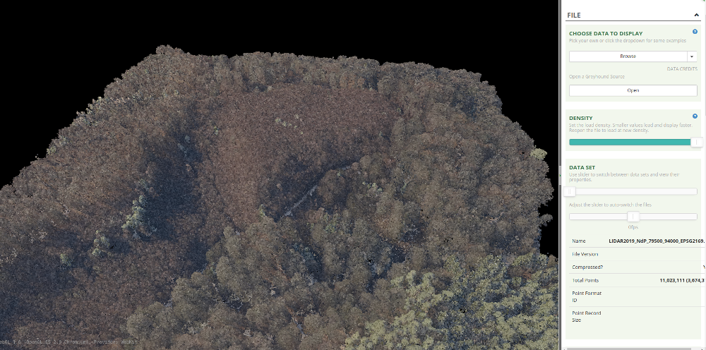
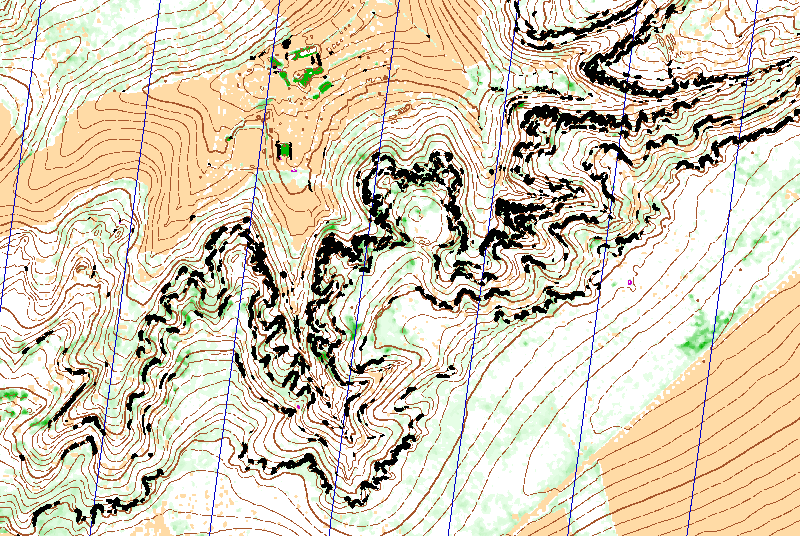
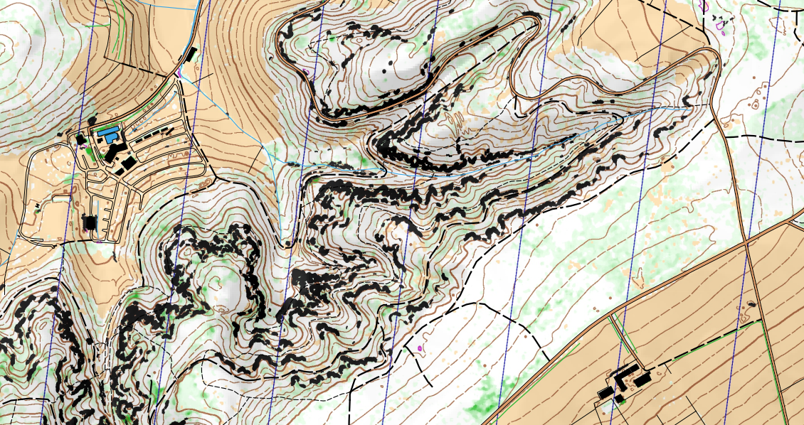

# How to produce an orienteering map from ACT LIDAR data with Karttapullatin?

This is a tutorial for anyone interested in mapping natural areas of Luxembourg using the [ACT LIDAR data](https://act.public.lu/fr/cartographie/lidar.html). This is provided by the [Luxembourg Orienteering Club](https://orienteering.lu/) (feel free to [join us](https://orienteering.lu/en/join/)!).

[](https://orienteering.lu)

## Requirements

- A PC with Windows.
- A bit of time and maybe resilience !

## Download the ACT LIDAR data

From [this page](https://gist.github.com/grischard/0a2b5ade272a3ed351e5c269c3e30a89), download the data tiles corresponding to the extent of your map. Click on each of the tiles corresponding to the map extent. A popup window will then open and show the download URL of the corresponding file. To download the file, simply copy this URL and paste it in your web browser URL field.

As an example, we are going to make a map of Noumerléen:


For our case, we need those 4 downloads:
  - [lidar2019-ndp-c20-r24-ll78500-92500-epsg2169.zip](https://download.data.public.lu/resources/lidar-2019-releve-3d-du-territoire-luxembourgeois/20200109-075037/lidar2019-ndp-c20-r24-ll78500-92500-epsg2169.zip)
  - [lidar2019-ndp-c20-r25-ll78500-94000-epsg2169.zip](https://download.data.public.lu/resources/lidar-2019-releve-3d-du-territoire-luxembourgeois/20200109-075309/lidar2019-ndp-c20-r25-ll78500-94000-epsg2169.zip)
  - [lidar2019-ndp-c21-r24-ll80000-92500-epsg2169.zip](https://download.data.public.lu/resources/lidar-2019-releve-3d-du-territoire-luxembourgeois/20200109-093636/lidar2019-ndp-c21-r24-ll80000-92500-epsg2169.zip)
  - [lidar2019-ndp-c21-r25-ll80000-94000-epsg2169.zip](https://download.data.public.lu/resources/lidar-2019-releve-3d-du-territoire-luxembourgeois/20200109-093959/lidar2019-ndp-c21-r25-ll80000-94000-epsg2169.zip)

Each zip file size is around 300/500Mo.

- Unzip the downloaded zip file. Each of them should contain 9 *\*.laz* files. So, for our example, we have 9x4=36 *\*.laz* files.
- You can easily visualise the *\*.laz* files with [plas.io](https://plas.io/). This provides some overview of the input data.

[](https://plas.io/)

## Get Karttapullatin software and prepare the workspace

- Decide on a working folder on your PC, for example: *E:myfolder/myfolder2/workspace/*. This could be a folder on your desktop or anywhere else. No matter.
- Create a folder for the input data: *.../workspace/in/noumerleen/*. Move there the downloaded *\*.laz* files. For our example, we should then have the 36 *\*.laz* files in this folder.
- Download Karttapullatin software on [Karttapullatin website](http://www.routegadget.net/karttapullautin/). Download the version of the program corresponding to your PC (64 of 32 bits). For modern PCs, 64 bits is the one to use.
- No need for any installation: Just move the software executable files here: *.../workspace/karttapullautin_standalone/*
- Download and unzip [las2txt](https://github.com/jgaffuri/OriMap/raw/master/docs/howtoactlidar/las2txt.zip). Move the file *las2txt.exe* here: *.../workspace/karttapullautin_standalone/*. Alternativelly, you can install libLAS following [these instructions](https://liblas.org/osgeo4w.html), but it is simpler to simply put *las2txt.exe* manually...
- Prepare a folder for the outputs: *.../workspace/out/noumerleen/*

## Setup Karttapullatin

The program parameters are defined in the *workspace/karttapullautin_standalone/pullauta.ini* file.
- Edit this *pullauta.ini* file and find the place with:

```
# batch process mode, process all laz ans las files of this directory
# off=0, on=1  
batch=0

# processes
processes=2

# batch process output folder
batchoutfolder=./out

# batch process 

# batch process input file folder
lazfolder=./in
```

- Modify this section with these parameter values:

```
batch=1
processes=1
batchoutfolder=../out/noumerleen/
lazfolder=../in/noumerleen/
```

- If you know the number of processors available on your PC, you can specify how many will be used by karttapullautin with `processes=XXX` parameter. This will allow a parallel and thus faster computation.
- **Launch the program** with e double click on: *pullauta.exe*. This may take several hours to complete depending on the number and size of the *\*.laz* files to process and the computation power of the PC. You can follow the process progress by looking at the content of the *.../workspace/out/noumerleen/* folder, where the output is progressively produced, tile after tile. Some images can be viewed there, step after step.

Once the process is complete, we are not done yet: The process produces 1 output for each tile, and we need to merge all these outputs into a single one. An easy way to proceed the following:

- Create a *merge.bat* file in *.../workspace/karttapullautin_standalone/* folder (right click, then *new file*). Edit it as a text file and add the following content:

```
pullauta pngmerge 1
pullauta pngmergedepr 1
pullauta pngmergevege
pullauta dxfmerge
```
- Double click on this *merge.bat* file to execute all the commands listed here, which merge the outputs. As a result, several **merged_XXXX.YYY** files are produced in the *.../workspace/karttapullautin_standalone/* folder. There are *\*.png* and *\*.jpg* image files, which can be viewed as a normal image, and also *\*.dxf* files, which can be imported in other mapping software (as explained below).

Here is the output obtained for our Noumerléen map:

[](https://raw.githubusercontent.com/jgaffuri/OriMap/master/docs/howtoactlidar/img/merged_depr.png)

(Download [full size](https://raw.githubusercontent.com/jgaffuri/OriMap/master/docs/howtoactlidar/img/merged_depr.png))

- If the output is not satisfying and do not show properly natural features that you know are present on the field, it is possible to fine-tune some parameters in the *pullauta.ini* file. Most of them are explained directly in the file. You can also check the documentation on [Karttapullatin website](http://www.routegadget.net/karttapullautin/) or ask some advice on the [RouteGadget Facebook page](https://www.facebook.com/RouteGadget-177518995597572/).

## After...

- The output *\*.dxf* files can be imported as vector features in mapping software such as [OCAD](https://www.ocad.com/), [OpenOrienteering Mapper](https://www.openorienteering.org/apps/mapper/) or [QGIS](https://qgis.org/). Image outputs can also be used as a backdrop to be digitalised or to support field surveys.
- Other geographical data sources can be used for non-natural features which are not detected properly by karttapullautin. Here are some of them:
  - The Luxembourgish national topographic data base, whose 2015 version can be downloaded freely [**here**](https://data.public.lu/en/datasets/bd-l-tc-2015/). This include some excellent information for building footprints, transport networks (from main roads to hiking tracks), and many other man-made and natural features shown on topographic maps.
  - [OpenStreetMap](https://www.openstreetmap.org/). An extraction for Luxembourg is available [here](http://download.geofabrik.de/europe/luxembourg.html).

This additional vector data can be displayed together or on top of the karttapullautin image to offer some better overview. Here is the output obtained for our Noumerléen map:

[](https://github.com/jgaffuri/OriMap/raw/master/docs/lidaroutputs/noumerleen.pdf)

(Download [full size](https://github.com/jgaffuri/OriMap/raw/master/docs/lidaroutputs/noumerleen.pdf))

This could be seen as a 'good enough' map for some trainings or simply to detect some interesting areas to be then better mapped with unavoidable field surveys.

See some other examples of maps [**here**](../lidaroutputs).

## Any comment? Anything unclear, missing, incorrect or wrong? Feel free to edit the file or create an issue [here](https://github.com/jgaffuri/OriMap/issues).
