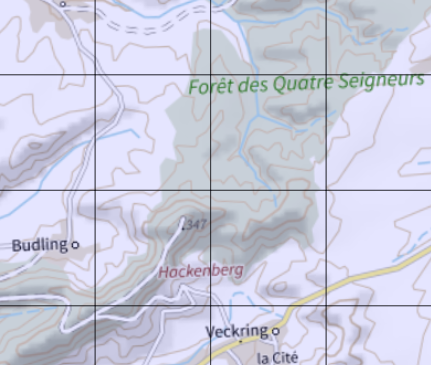
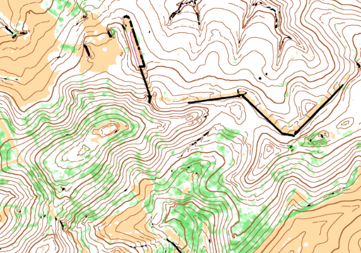

# Comment produire une carte de course d'orientation à partir des données LIDAR HD IGN avec Karttapullatin?


## Télécharger les données LIDAR HD IGN

Rendez-vous sur [le site de l'IGN](https://www.ign.fr/) pour télécharger les données LIDAR HD classifiées sur votre zone d'intérêt: Voir [cette section](https://geoservices.ign.fr/lidarhd#telechargementclassifiees) ou [cette carte interactive](https://diffusion-lidarhd.ign.fr/) .

Pour ce tutoriel, notre zone d'intérêt correspond aux alentours du fort du Hackenberg:



Pour cette zone, 4 fichiers doivent être téléchargés. Chaque fichier correspond à une zone carrée de 1km². Ces fichiers sont au format *\*.laz* et font environ 100/150 Mo. Chaque fichier peut être visualisé facilement avec [plas.io](https://plas.io/), pour un apercu rapide des données.

## Télécharger le logiciel Karttapullatin et preparer l'espace de travail

- Choisir un dossier de travail sur votre PC, par exemple *E:monDossier/monDossier2/tutoriel/*. Ca peut être simplement un dossier sur votre bureau...
- Créer des sous-dossiers où mettre les données téléchargée: *.../tutoriel/entree/hackenberg/*. Y placer les 4 fichiers *\*.laz* téléchargés.
- Télécharger le logiciel Karttapullatin depuis [le site Karttapullatin](http://www.routegadget.net/karttapullautin/). Télécharger la version 32 ou 64 bits en fonction de votre PC - s'il est récent, ce devrait être un 64 bits.
- Pas besoin d'installer le lociciel: Déplacez juste le dossier téléchargé et décompréssé ici: *.../tutoriel/karttapullautin_standalone/*
- Preparer un dossier pour les résultats produits par le logiciel: *.../tutoriel/sortie/hackenberg/*
- Télécharger et décomppresser [ces programmes issus de lastools](https://github.com/jgaffuri/OriMap/raw/master/docs/tutoriel/las_exe.zip). Placer les fichiers *\*.exe* dans le dossier *.../tutoriel/karttapullautin_standalone/*. Il est aussi possible d'installer le programme libLAS ([voir ici](https://liblas.org/osgeo4w.html)).

## Paramétrer Karttapullatin

Les paramètres du programme sont spécifiés dans le fichier texte: *.../tutoriel/karttapullautin_standalone/pullauta.ini* file.

- Editer le fichier *pullauta.ini* (avec notepad ou n'importe quel programme d'édition de fichier texte) et trouver l'endroit avec ces lignes:

```
# batch process mode, process all laz ans las files of this directory
# off=0, on=1  
batch=0

# processes
processes=2

# batch process output folder
batchoutfolder=./out

# batch process input file folder
lazfolder=./in
```

- Remplacer ces lignes par:

```
batch=1
processes=1
batchoutfolder=../sortie/hackenberg/
lazfolder=../entree/hackenberg/
```

- Si vous connaissez le nombre de processeurs de votre PC, vous pouvez spécifier combien seront utilisés par karttapullautin avec le paramètre `processes=XXX`. Cela permettra d'utiliser plusieurs processeurs en parallèle et donc accelerer le processus.
- **Lancer le programme** en double-cliquant sur: *pullauta.exe*. L'execution peut prendre du temps en fonction du nombre et de la taille des fichiers *\*.laz* en entrée et des capacités de calcul du PC. L'avancée peut être suivie en examinant le contenu du dossier de sortie *.../tutoriel/sortie/hackenberg/*.

Une fois le calcul terminé, ce n'est pas encore fini: Le processus a en effet produit un ensemble de fichiers pour chacun des fichiers *\*.laz* en entrée. Ces fichiers doivent être fusionnés. Pour cela:

- Créer un fichier *fusion.bat* dans le dossier *.../tutoriel/karttapullautin_standalone/*.
- Editer *fusion.bat* et y ajouter les lignes suivante:

```
pullauta pngmerge 1
pullauta pngmergedepr 1
pullauta pngmergevege
pullauta dxfmerge
```

- Double-cliquer sur le fichier *fusion.bat* pour l'executer, ce qui a pour effet de fusionner les fichiers en sortie de dossier *.../tutoriel/sortie/hackenberg/*. Comme résultat, plusieurs fichiers **merged_XXXX.YYY** sont produits dans le dossier *.../tutoriel/karttapullautin_standalone/*. Il y a des fichiers images *\*.png* and *\*.jpg*, qui peuvent être affichés comme n'importe quel fichier image, et également des fichiers de données *\*.dxf*, qui peuvent être importés dans des logiciels de cartographie (comme expliqué ci-dessous).

Voici un des fichiers obtenus pour notre zone test à Hackenbourg::

[](https://raw.githubusercontent.com/jgaffuri/OriMap/master/docs/tutoriel/img/merged_depr.png)

([Télécharger](https://raw.githubusercontent.com/jgaffuri/OriMap/master/docs/tutoriel/img/merged_depr.png))

- Si le résultat n'est pas satisfaisant et ne montre pas correctement les objets naturels que vous savez être présents sur le terrain, il est possible d'ajuster certains paramètres dans le fichier *pullauta.ini*. La plupart de ces paramètres sont décrits, en anglais, directement dans le fichier. Il est également possible de consulter les documentation sur [le site Karttapullatin](http://www.routegadget.net/karttapullautin/) ou bien demander conseil sur [la page Facebook de RouteGadget](https://www.facebook.com/RouteGadget-177518995597572/).

## Et ensuite...


- The output *\*.dxf* files can be imported as vector features in mapping software such as [OCAD](https://www.ocad.com/), [OpenOrienteering Mapper](https://www.openorienteering.org/apps/mapper/) or [QGIS](https://qgis.org/). Image outputs can also be used as a backdrop to be digitalised or to support field surveys.
- Other geographical data sources can be used for non-natural features which are not detected properly by karttapullautin. Here are some of them:
  - The Luxembourgish national topographic data base, whose 2015 version can be downloaded freely [**here**](https://data.public.lu/en/datasets/bd-l-tc-2015/). This include some excellent information for building footprints, transport networks (from main roads to hiking tracks), and many other man-made and natural features shown on topographic maps.
  - [OpenStreetMap](https://www.openstreetmap.org/). An extraction for Luxembourg is available [here](http://download.geofabrik.de/europe/luxembourg.html).

This additional vector data can be displayed together or on top of the karttapullautin image to offer some better overview. Here is the output obtained for our Noumerléen map:

[](https://github.com/jgaffuri/OriMap/raw/master/docs/lidaroutputs/noumerleen.pdf)

(Download [full size](https://github.com/jgaffuri/OriMap/raw/master/docs/lidaroutputs/noumerleen.pdf))

This could be seen as a 'good enough' map for some trainings or simply to detect some interesting areas to be then better mapped with unavoidable field surveys.

See some other examples of maps [**here**](../lidaroutputs).

## Any comment? Anything unclear, missing, incorrect or wrong? Feel free to edit the file or create an issue [here](https://github.com/jgaffuri/OriMap/issues).
