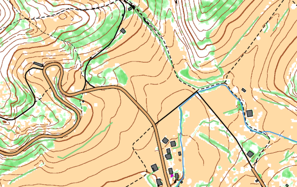

# Comment produire une (pseudo) carte de course d'orientation à partir des données LIDAR HD IGN, avec Karttapullatin?


## Télécharger les données LIDAR HD IGN

Aller sur [le site de l'IGN](https://www.ign.fr/) pour télécharger les données LIDAR HD classifiées sur votre zone d'intérêt: Voir [cette section](https://geoservices.ign.fr/lidarhd#telechargementclassifiees) ou [cette carte interactive](https://diffusion-lidarhd.ign.fr/) .

Pour ce tutoriel, notre zone d'intérêt correspond aux alentours du fort du Hackenberg:


Pour cette zone, 6 fichiers doivent être téléchargés. Chaque fichier correspond à une zone carrée de 1km². Ces fichiers sont au format *\*.laz* et font environ 100/150 Mo chacun.

Chaque fichier peut être visualisé facilement avec [plas.io](https://plas.io/), pour un apercu rapide des données (<- enfin bon, au dernier essai, ça marchait pas mais c'est pas bien grave).

## Télécharger le logiciel Karttapullatin et preparer l'espace de travail

- Choisir un dossier de travail sur votre PC, par exemple *C:monDossier/monDossier2/tutoriel/*. Ca peut être simplement un dossier sur votre bureau...
- Créer des sous-dossiers où mettre les données téléchargée: *.../tutoriel/entree/hackenberg/*. Y placer les 6 fichiers *\*.laz* téléchargés.
- Télécharger le logiciel Karttapullatin depuis [le site Karttapullatin](http://www.routegadget.net/karttapullautin/). Télécharger la version 32 ou 64 bits en fonction de votre PC - s'il est récent, ce devrait être un 64 bits.
- Pas besoin d'installer le lociciel: Déplacez juste le dossier téléchargé et décompréssé ici: *.../tutoriel/karttapullautin_standalone/*
- Preparer un dossier pour les résultats produits par le logiciel: *.../tutoriel/sortie/hackenberg/*
- Télécharger et décomppresser [ces programmes issus de lastools](https://github.com/jgaffuri/OriMap/raw/master/docs/tutoriel/las_exe.zip). Placer les fichiers *\*.exe* dans le dossier *.../tutoriel/karttapullautin_standalone/*. Il est visiblement aussi possible d'installer le programme libLAS ([voir ici](https://liblas.org/osgeo4w.html)) mais j'ai pas testé.

## Paramétrer Karttapullatin

Les paramètres du programme sont spécifiés dans le fichier texte: *.../tutoriel/karttapullautin_standalone/pullauta.ini*.

- Editer le fichier *pullauta.ini* (avec notepad ou n'importe quel programme d'édition de fichier texte) et trouver l'endroit avec ces lignes:

```
# batch process mode, process all laz ans las files of this directory
# off=0, on=1  
batch=0

# processes
processes=2

# batch process output folder
batchoutfolder=./out

# batch process input file folder
lazfolder=./in
```

- Remplacer ces lignes par:

```
batch=1
processes=1
batchoutfolder=../sortie/hackenberg/
lazfolder=../entree/hackenberg/
```

Ca dit au programme de traiter les données du dossier `lazfolder=../entree/hackenberg/`, de traiter tous les fichiers ensemble (`batch=1`) en utilisant un processeur (`processes=1`) et de placer les résultats dans le dossier `batchoutfolder=../sortie/hackenberg/`.

- Si vous connaissez le nombre de processeurs de votre PC, vous pouvez spécifier combien seront utilisés par karttapullautin avec le paramètre `processes=XXX`. Cela permettra d'utiliser plusieurs processeurs en parallèle et donc d'accelerer le processus.
- **Lancer le programme** en double-cliquant sur: *pullauta.exe*. L'execution peut prendre du temps en fonction du nombre et de la taille des fichiers *\*.laz* en entrée et des capacités de calcul du PC. L'avancée peut être suivie en examinant le contenu du dossier de sortie *.../tutoriel/sortie/hackenberg/*.

Une fois le calcul terminé, ce n'est pas encore fini: Le processus a en effet produit un ensemble de fichiers pour chacun des fichiers *\*.laz* en entrée. Ces fichiers doivent être fusionnés. Pour cela:

- Créer un fichier *fusion.bat* dans le dossier *.../tutoriel/karttapullautin_standalone/*.
- Editer *fusion.bat* et y ajouter les lignes suivante:

```
pullauta pngmerge 1
pullauta pngmergedepr 1
pullauta pngmergevege
pullauta dxfmerge
```

- Double-cliquer sur le fichier *fusion.bat* pour l'executer, ce qui a pour effet de fusionner les fichiers en sortie de dossier *.../tutoriel/sortie/hackenberg/*. Comme résultat, plusieurs fichiers **merged_XXXX.YYY** sont produits dans le dossier *.../tutoriel/karttapullautin_standalone/*. Il y a des fichiers images *\*.png* and *\*.jpg*, qui peuvent être affichés comme n'importe quel fichier image, et également des fichiers de données *\*.dxf*, qui peuvent être importés dans des logiciels de cartographie (comme expliqué ci-dessous).

Voici un des fichiers obtenus pour notre zone test à Hackenbourg::

[](https://raw.githubusercontent.com/jgaffuri/OriMap/master/docs/tutoriel/img/merged_depr.png)

([Télécharger](https://raw.githubusercontent.com/jgaffuri/OriMap/master/docs/tutoriel/img/merged_depr.png))

- Si le résultat n'est pas satisfaisant et ne montre pas correctement les objets naturels que vous savez être présents sur le terrain, il est possible d'ajuster certains paramètres dans le fichier *pullauta.ini*. La plupart de ces paramètres sont décrits, en anglais, directement dans le fichier. Il est également possible de consulter les documentation sur [le site Karttapullatin](http://www.routegadget.net/karttapullautin/) ou bien demander conseil sur [la page Facebook de RouteGadget](https://www.facebook.com/RouteGadget-177518995597572/).

## Et ensuite...

Les fichiers *\*.dxf* produits peuvent être importés comme couches vectorielles dans un logiciel de cartographie tel que [OCAD](https://www.ocad.com/), [OpenOrienteering Mapper](https://www.openorienteering.org/apps/mapper/) ou [QGIS](https://qgis.org/).

Les images produites peuvent être utlisées comme fond de carte pour être vectorisés ou en support à des levers terrain.

D'autres sources de données géographiques peuvent être utilisées, en particulier pour les objets non naturels (bâtiments, routes, chemins, etc.) qui ne sont pas très bien détectés par karttapullautin. Une bonne source de donnée est la [BD TOPO](https://geoservices.ign.fr/bdtopo) de l'[IGN](https://www.ign.fr/) qui peut être téléchargée par département sur [cette page](https://geoservices.ign.fr/bdtopo). Voir aussi peut-être le contenu de [OpenStreetMap](https://www.openstreetmap.org/) dont des extractions par région sont disponibles [ici](https://download.geofabrik.de/europe/france.html).

Ces sources de données vectorielles peuvent être affichées au-dessus de la carte obtenue par karttapullautin.

Pour le zone selectionnée, nous avons téléchargé les données [BD TOPO](https://geoservices.ign.fr/bdtopo) sur tout le département de la Moselle, au format GPKG. Les données de la BD TOPO sur les bâtiments, routes, chemins, sentiers, hydrographie, haies, et autres objets topographiques usuels des cartes de CO ont été importées dans le logiciel [QGIS](https://qgis.org/). Ces objets ont été symbolisés conformément aux [specifications] pour une carte à 1:10'000. La carte *merge_depr.png* issue de karttapullautin a été ajoutée comme fond de carte.




Le résultat final peut être exporté au format PDF, pour une carte à 1:10'000 au format A4:

[](https://github.com/jgaffuri/OriMap/raw/master/docs/lidaroutputs/hackenberg.pdf)

(Download [full size](https://github.com/jgaffuri/OriMap/raw/master/docs/lidaroutputs/hackenberg.pdf))

Une telle carte, bien qu'imparfaite, donne un bon aperçu de la zone. Pour une vraie carte de CO, un gros travail de contrôle et lever terrain, ainsi que de rédaction cartographique et de reprise est nécessaire.

Voir d'autres exemples de cartes [**ici**](../lidaroutputs).

## Un commentaire? Quelque chose de pas clair, ma,quant, incorrect ou faux? N'hésitez pas à éditer le tutoriel ou discuter [ici](https://github.com/jgaffuri/OriMap/issues).
